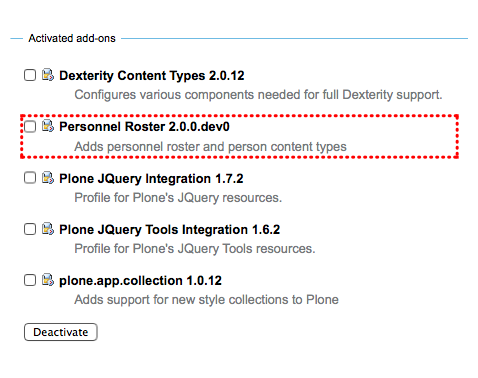
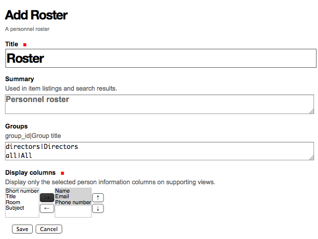
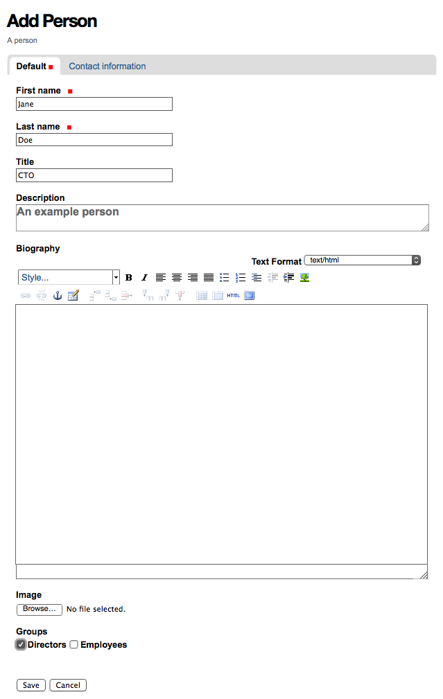
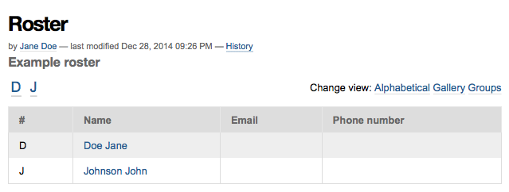
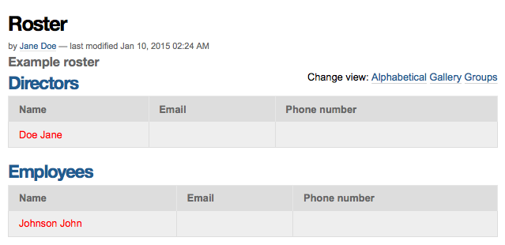
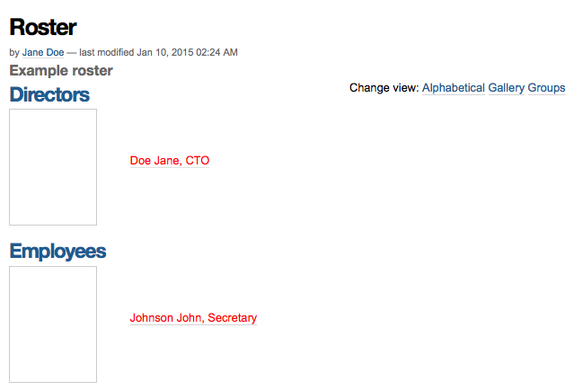
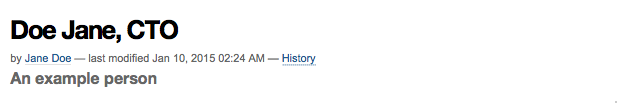
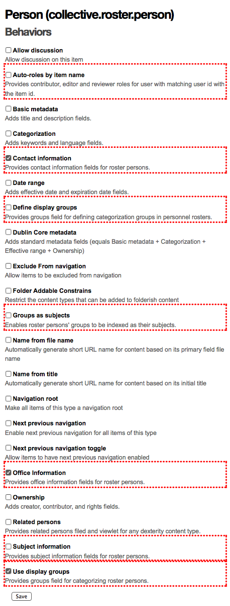

Personnel Roster
================

**collective.roster** aka Personnel Roster provides highly customizable
personnel listing, which can be extended easily with custom file system
developed add-ons.

.. include:: _robot.rst

.. code:: robotframework

    Show product as activated
        Go to  ${PLONE_URL}/prefs_install_products_form

        Assign id to element
        ...  ${SELECTOR_ADDONS_ROSTER}
        ...  addons-enabled

        Element should contain  ${SELECTOR_ADDONS_ROSTER}  Personnel Roster
        Highlight  ${SELECTOR_ADDONS_ROSTER}

        Capture and crop page screenshot
        ...  roster-product-activated.png
        ...  id=addons-enabled

Adding a new roster
===================

.. code:: robotframework

    Show adding a new roster
        Go to  ${PLONE_URL}/++add++collective.roster.roster
        Page should contain  Add Roster

        Input text  form.widgets.IBasic.title  Roster
        Input text  form.widgets.IBasic.description  Example roster
        Input text  form.widgets.IGroupsProvider.groups
        ...         directors|Directors\nemployees|Employees
        Select from list  form.widgets.columns_display.from
        ...               collective.roster.personnellisting.name
        Click button  from2toButton
        Select from list  form.widgets.columns_display.from
        ...               collective.roster.personnellisting.email
        Click button  from2toButton
        Select from list  form.widgets.columns_display.from
        ...               collective.roster.personnellisting.phone_number
        Click button  from2toButton

        Capture and crop page screenshot
        ...  roster-add-form.png  css=#content

        Click button  Save
        Page should contain  Item created

Adding a new person
===================

.. code:: robotframework

    Show adding a new person
        Go to  ${PLONE_URL}/roster/++add++collective.roster.person
        Page should contain  Add Person

        Input text  form.widgets.first_name  Jane
        Input text  form.widgets.last_name  Doe
        Input text  form.widgets.position  CTO
        Input text  form.widgets.description  An example person

        Select check box  css=#form-widgets-IGroups-groups-0

        Capture and crop page screenshot
        ...  person-add-form.png  css=#content

        Click button  Save
        Page should contain  Item created

        Go to  ${PLONE_URL}/roster/++add++collective.roster.person
        Page should contain  Add Person

        Input text  form.widgets.first_name  John
        Input text  form.widgets.last_name  Johnson
        Input text  form.widgets.position  Secretary

        Select check box  css=#form-widgets-IGroups-groups-1

        Click button  Save
        Page should contain  Item created

Alphabetical listing
====================

.. code:: robotframework

    Show alpha view
        Go to  ${PLONE_URL}/roster/@@alpha_view
        Page should not contain  Directors
        Page should not contain  Employees
        Page should contain  Doe Jane
        Page should contain  Johnson John
        Page should not contain  Doe Jane, CTO
        Page should not contain  Johnson John, Secretary

        Capture and crop page screenshot
        ...  roster-alpha-view.png  css=#content

Groups listing
==============

.. code:: robotframework

    Show groups view
        Go to  ${PLONE_URL}/roster/@@groups_view
        Page should contain  Directors
        Page should contain  Employees
        Page should contain  Doe Jane
        Page should contain  Johnson John
        Page should not contain  Doe Jane, CTO
        Page should not contain  Johnson John, Secretary

        Capture and crop page screenshot
        ...  roster-groups-view.png  css=#content

Gallery listing
===============

.. code:: robotframework

    Show gallery view
        Go to  ${PLONE_URL}/roster/@@gallery_view
        Page should contain  Directors
        Page should contain  Employees
        Page should contain  Doe Jane, CTO
        Page should contain  Johnson John, Secretary

        Capture and crop page screenshot
        ...  roster-gallery-view.png  css=#content

Person view
===========

.. code:: robotframework

    Show person view
        Go to  ${PLONE_URL}/roster/doe-jane
        Page should contain  An example person

        Capture and crop page screenshot
        ...  person-view.png  css=#content

Person viewlets manager
=======================

.. figure:: person-viewlets-manager.png
.. code:: robotframework

    Show person viewlets manager
        Go to  ${PLONE_URL}/roster/doe-jane/@@manage-viewlets
        Page should contain  ViewletManager: collective.roster.personviewlets

        Capture and crop page screenshot
        ...  person-viewlets-manager.png  css=#content

Available behaviors
===================

.. code:: robotframework

    Show available behaviors
        Go to  ${PLONE_URL}/dexterity-types/collective.roster.person/@@behaviors
        Page should contain  Behaviors

        Assign id to element
        ...  xpath=//*[@id='form-widgets-collective-roster-behaviors-interfaces-IContactInfo']/parent::*/parent::*
        ...  behaviors-contact-info
        Page should contain element  behaviors-contact-info
        Highlight  behaviors-contact-info

        Assign id to element
        ...  xpath=//*[@id='form-widgets-collective-roster-behaviors-interfaces-IAutoRoles']/parent::*/parent::*
        ...  behaviors-auto-roles
        Page should contain element  behaviors-auto-roles
        Highlight  behaviors-auto-roles

        Assign id to element
        ...  xpath=//*[@id='form-widgets-collective-roster-behaviors-interfaces-IGroupsProvider']/parent::*/parent::*
        ...  behaviors-groups-provider
        Page should contain element  behaviors-groups-provider
        Highlight  behaviors-groups-provider

        Assign id to element
        ...  xpath=//*[@id='form-widgets-collective-roster-behaviors-interfaces-IGroups']/parent::*/parent::*
        ...  behaviors-groups
        Page should contain element  behaviors-groups
        Highlight  behaviors-groups

        Assign id to element
        ...  xpath=//*[@id='form-widgets-collective-roster-behaviors-interfaces-IGroupsAsSubjects']/parent::*/parent::*
        ...  behaviors-groups-as-subjects
        Page should contain element  behaviors-groups-as-subjects
        Highlight  behaviors-groups-as-subjects

        Assign id to element
        ...  xpath=//*[@id='form-widgets-collective-roster-behaviors-interfaces-IRelatedPersons']/parent::*/parent::*
        ...  behaviors-related-persons
        Page should contain element  behaviors-related-persons
        Highlight  behaviors-related-persons

        Assign id to element
        ...  xpath=//*[@id='form-widgets-collective-roster-behaviors-interfaces-IOfficeInfo']/parent::*/parent::*
        ...  behaviors-office-info
        Page should contain element  behaviors-office-info
        Highlight  behaviors-office-info

        Assign id to element
        ...  xpath=//*[@id='form-widgets-collective-roster-behaviors-interfaces-ISubjectInfo']/parent::*/parent::*
        ...  behaviors-subject-info
        Page should contain element  behaviors-subject-info
        Highlight  behaviors-subject-info

        Capture and crop page screenshot
        ...  behaviors-manager.png  css=#content
